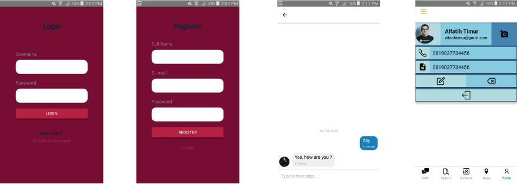

<h1 align="center">Bounce Chat</h1>
<p align="center">
  
  
</p>
<p align="center">
  Built with React Native.
</p>

## Table of Contents

- [Introduction](#introduction)
- [Requirements](#requirements)
- [Usage](#usage-for-development)
- [Create Environment Variable](#create-environment-variable)
- [Screenshots](#screenshots)
- [Release APK](#release-apk)
- [Related Project](#related-project-backend)

## Introduction

<b>Bounce Chat</b> is a chat application that was built with react native using backend firebase is very fast for everyday use, and there are also maps to find out friends who are around us.

## Requirements
- [`nodeJS`](https://nodejs.org/en/download/)
- [`npm`](https://www.npmjs.com/get-npm)
- [`react-native-cli`](https://facebook.github.io/react-native/docs/getting-started)
- [`Backend Firebase`](https://firebase.google.com/)

## Usage for development

1. Open your terminal or command prompt
2. Type `git clone https://github.com/iipshoifuddin/HiringChannelsWithReactNative`
3. Open the folder and type `npm install` for install dependencies
4. Create environment variable [here](#create-environment-variable)
5. Type `react-native run-android` for run this app. **_Make sure your device is connected with debugging mode_**.

## Create Environment Variable

For Linux /src/auth/firebase.js :
```
$ cp .env.example .env
$ nano .env
```

For Windows :
```
$ copy .env.example .env
```
and open .env file with text editor

# Set Firebase KEY

```
    API_KEY = YOUR_API_KEY
    AUTH_DOMAIN = YOUR_AUTH_DOMAIN
    DATABASE_URL = YOUR_DATABASE_URL 
    PROJECT_ID = YOUR_PROJECT_ID
    STORAGE_BUCKET = YOUR_STORAGE_BUCKET
    MESSAGING_SENDER_ID = YOUR_MESSAGING_SENDER_ID
    APP_ID = YOUR_APP_ID
    MEASUREMENT_ID = YOUR_MEASUREMENT_ID
```

## Screenshots

<div align="center">
    
</div>

## Release APK

<a href="https://drive.google.com/file/d/1o2NU95UqoxDaLGotjUrnfTCHLfJxkeyI/view?usp=sharing">
  
</a>

## Related Project (Backend)

- [`Backend Firebase`](https://firebase.google.com/)


